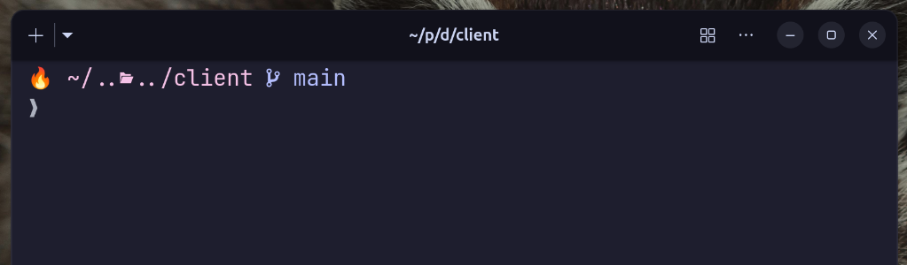

# ✨ Miner, Oh My Posh Theme

A minimal, elegant, and developer-friendly Oh My Posh theme designed to make your terminal look clean and powerful.

---

## 📸 Preview



---

## 🚀 Installation

Apply this theme with a single command:

```bash
oh-my-posh init <your-shell> --config $HOME/full/path/to/miner.opm.json | source
```

### Example (Fish shell):

```bash
oh-my-posh init fish --config $HOME/full/path/to/miner.opm.json | source
```

---

## 📦 Usage

1. Download or clone this repository
2. Place the `.opm.json` theme file somewhere on your system
3. Run the install command (above) with the correct path
4. (Optional) Add it to your shell config for persistence

### Persistent setup example (Fish):

```bash
echo 'oh-my-posh init fish --config $HOME/full/path/to/miner.opm.json | source' >> ~/.config/fish/config.fish
```

---

## 🎨 Features

* Clean and modern design
* Minimalist
* Git-aware segments

---

## 🛠 Requirements

* [Oh My Posh](https://ohmyposh.dev/)

---

## 📄 License

Feel free to use, modify, and share this theme.

---

## 💡 Contributing

If you improve this theme or create variations, feel free to share them!

---
